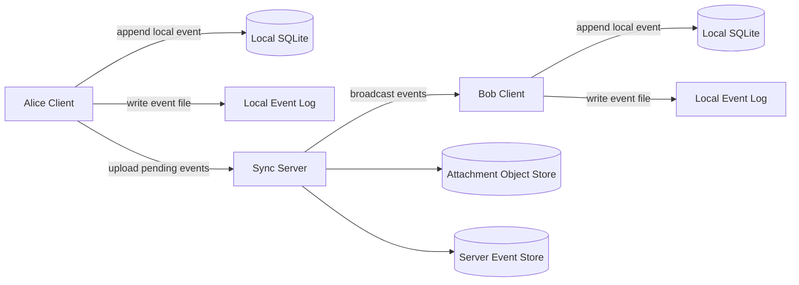
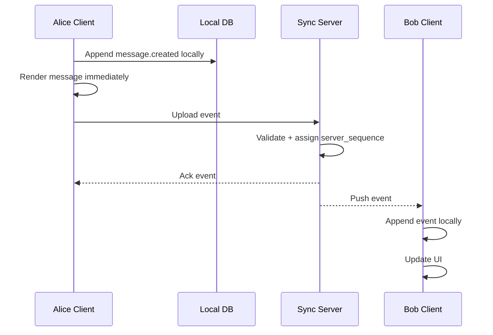
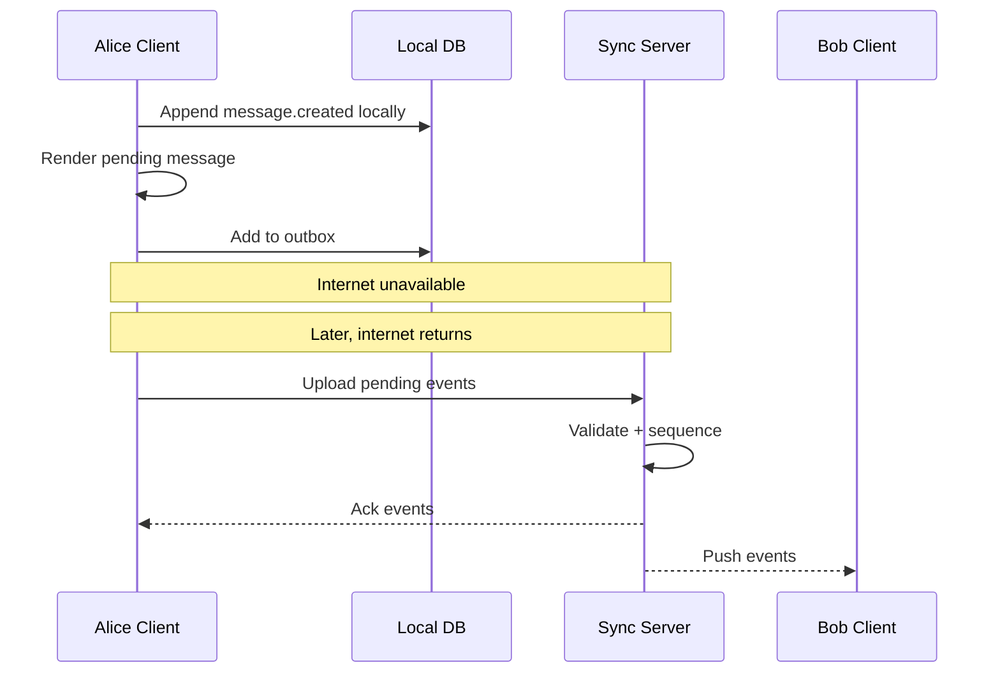
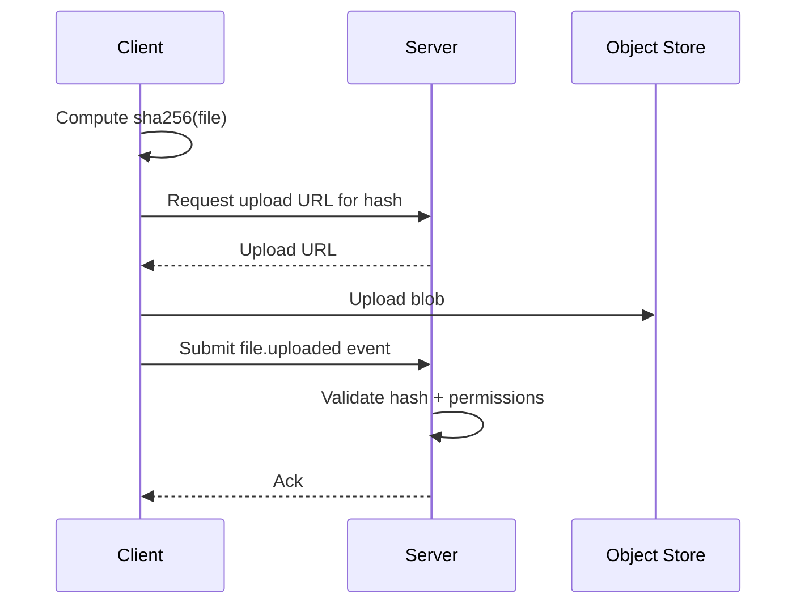
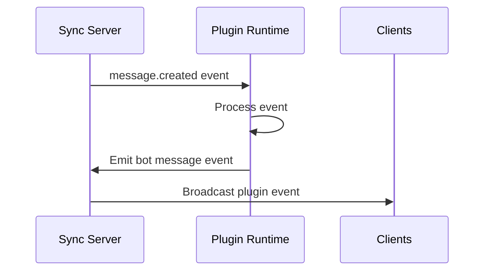

# Local-First, File-Based Team Messaging App — Design Doc

**Status:** Draft  
**Author:** Mohanad / ChatGPT  
**Date:** 2026-07-03  
**Working name:** TBD  
**One-line pitch:** **Slack-quality team messaging where the workspace is portable, self-hostable, scriptable, and syncs like Git.**

---

## 1\. Summary

This document proposes a local-first, file-based messaging application inspired by Slack, but designed around ownership, portability, self-hosting, federation, and extensibility.

The core idea:

> Each user has a complete local copy of the workspace event log. Messages, reactions, edits, pins, files, and plugin actions are represented as immutable events. The local app renders a fast SQLite projection from those events. A server helps relay and synchronize events between team members, but it is not the only source of truth.

The initial product should not try to beat Matrix, Mattermost, [Rocket.Chat](<http://Rocket.Chat>), or Zulip on protocol ambition. It should instead focus on a sharper wedge:

> **A polished Slack-like app for small technical teams that want ownership, local speed, file portability, and plugins.**

Federation can come later. The MVP should feel like Slack first and like infrastructure second.

---

## 2\. Problem

Slack is the best team messaging product in terms of user experience, speed, polish, integrations, and daily usability. However, it has major weaknesses for some teams:

* Workspace data is locked inside a cloud vendor.
* Self-hosting is not available.
* Full-fidelity export/import is limited.
* Offline usage is weak.
* Search and history depend on the service.
* Custom workflows require Slack's platform constraints.
* Long-term archival and ownership are not first-class.
* Federation between organizations is not native in the way open protocols imagine it.

Open/self-hosted alternatives exist, but many feel less polished or more complex than Slack.

This creates a product gap:

> A self-hosted/local-first team chat that preserves Slack-like usability while giving users durable ownership of their communication history.

---

## 3\. Goals

### Product goals

1. Provide a Slack-like experience:
   * channels
   * direct messages
   * threads
   * reactions
   * file sharing
   * mentions
   * unread state
   * search
   * keyboard shortcuts
   * fast channel switching
   * high-quality notifications
2. Make data portable:
   * workspace can be exported as files
   * event log is readable and durable
   * attachments are stored as content-addressed blobs
   * app can rebuild its local database from the event log
3. Make the app local-first:
   * local reads should not require the network
   * sending while offline should be possible
   * app should sync when connectivity returns
   * search should work locally
4. Make hosting simple:
   * one-command Docker deployment
   * small team can run it on a single VPS
   * no Kubernetes required for MVP
5. Make the system pluggable:
   * plugins can observe events
   * plugins can emit events
   * plugin permissions are explicit
   * Slack-style webhooks should be easy
6. Prepare for future federation:
   * protocol should support multiple servers later
   * event identity should not depend entirely on one server
   * workspace/channel boundaries should be clear

---

## 4\. Non-goals for MVP

The MVP should deliberately avoid these in version 1:

* Full Matrix-style federation.
* End-to-end encryption for all channels.
* Real-time collaborative document editing.
* Complex enterprise compliance.
* Perfect conflict-free editing for every object.
* Voice/video calls.
* Large public communities.
* Multi-million-user scale.
* Replacing Slack for huge enterprises on day one.

The first version should be excellent for a team of 5–50 people.

---

## 5\. Design Principles

### 5.1 Slack UX first

The architecture can be unique, but the user experience should feel familiar.

Users should see:

* channels
* messages
* threads
* emoji
* files
* mentions
* search
* notifications

They should not have to understand event logs, CRDTs, federation, or file sync.

### 5.2 Local-first under the hood

The local client should be able to:

* open the app without contacting the server
* render existing channels from local storage
* search local history
* queue outbound messages offline
* reconcile with the server later

The network should feel like sync, not like permission to use the app.

### 5.3 Immutable events, mutable projections

The source of truth is an append-only event log.

The app may maintain mutable views for performance:

* SQLite tables
* search indexes
* unread counters
* attachment metadata
* notification state

But these are derived from events and can be rebuilt.

### 5.4 Files are for ownership, databases are for speed

Pure file-based reads are elegant but slow for real chat UX.

Recommended model:

* durable event log stored as files
* local SQLite projection for fast reads/search
* content-addressed attachment blobs
* optional server database for relay/indexing

### 5.5 Federation later, not first

Federation is valuable, but it creates protocol and security complexity.

The MVP should use:

* client-local database
* self-hosted sync server
* single workspace authority

Later, this can evolve to:

* workspace-to-workspace federation
* server-to-server replication
* external channel invites

---

## 6\. Competitive Landscape

| Product | Strength | Weakness / gap |
| -- | -- | -- |
| Slack | Best UX, integrations, polish | Cloud lock-in, no self-hosting, limited ownership |
| Mattermost | Self-hosted Slack-like app | Less delightful UX, enterprise/devops feel |
| [Rocket.Chat](<http://Rocket.Chat>) | Self-hosted, customizable | Less polished than Slack |
| Zulip | Strong async topic/thread model | Different mental model, less Slack-like |
| Element / Matrix | Federation, encryption, open protocol | Complex, UX often less smooth than Slack |
| Nextcloud Talk | Self-hosted collaboration suite | Chat is not the core magic |
| Discord | Great real-time community UX | Not file/local-first, not workplace ownership-focused |

Opportunity:

> Build a product that feels closer to Slack but has ownership properties closer to Git/Obsidian.

---

## 7\. Core Architecture

### 7.1 High-level architecture



### 7.2 Main components

#### Desktop/Web client

Responsible for:

* rendering UI
* local message store
* local search
* outbound event queue
* sync state
* notifications
* plugin sandbox for local plugins, if supported

#### Sync server

Responsible for:

* authentication
* authorization
* event validation
* event sequencing
* event fanout
* attachment storage coordination
* WebSocket/SSE push
* optional server-side search for web clients
* admin APIs

#### File/event storage

Responsible for:

* durable event log
* portable workspace export
* replay/rebuild
* backup friendliness
* Git-like ownership model

#### Plugin runtime

Responsible for:

* running automations
* processing events
* integrating external services
* emitting bot messages
* enforcing plugin permissions

---

## 8\. Local Storage Model

Each client stores a local workspace folder.

Example:

```text
workspace-acme/
  workspace.json
  identity/
    user.json
    devices/
      device-01.json
  events/
    channels/
      general/
        2026-07.ndjson
      engineering/
        2026-07.ndjson
    dms/
      alice_bob/
        2026-07.ndjson
  attachments/
    blobs/
      sha256/
        ab/
          abcd1234...
    metadata/
      files.ndjson
  indexes/
    local.db
    search.db
  plugins/
    installed/
    config/
  sync/
    cursors.json
    outbox.ndjson
```

### Important detail

The app should not rely on reading thousands of tiny message files during normal usage.

Instead:

* append events to `.ndjson` logs
* project events into SQLite
* use SQLite for UI reads
* use event logs for sync/export/rebuild

---

## 9\. Event Model

Everything meaningful is an event.

Examples:

* `message.created`
* `message.edited`
* `message.deleted`
* `reaction.added`
* `reaction.removed`
* `thread.created`
* `channel.created`
* `channel.archived`
* `file.uploaded`
* `file.attached`
* `pin.added`
* `user.joined`
* `user.left`
* `plugin.installed`
* `plugin.event_emitted`

### 9.1 Event envelope

```json
{
  "event_id": "01JZ7N6A4M6Y8W5K2H7DGKX4PA",
  "workspace_id": "w_acme",
  "stream_id": "channel_general",
  "type": "message.created",
  "author_user_id": "u_alice",
  "author_device_id": "d_alice_macbook",
  "client_created_at": "2026-07-03T18:22:10.123Z",
  "server_received_at": "2026-07-03T18:22:10.456Z",
  "server_sequence": 9284,
  "prev_event_hash": "sha256:...",
  "event_hash": "sha256:...",
  "schema_version": 1,
  "payload": {
    "message_id": "m_01JZ7N6...",
    "channel_id": "c_general",
    "text": "Hello everyone",
    "format": "markdown"
  },
  "signature": "base64..."
}
```

### 9.2 Why use client-generated IDs?

Client-generated IDs allow offline creation.

The client can create a message while offline:

```json
{
  "event_id": "01JZ7OFFLINE...",
  "type": "message.created",
  "payload": {
    "message_id": "m_local_123",
    "text": "I am on the plane but still writing"
  }
}
```

Later, the server accepts it and assigns a `server_sequence`.

### 9.3 Event identity

Recommended:

* `event_id`: ULID or UUIDv7 generated by client.
* `message_id`: generated by client.
* `server_sequence`: assigned by server per stream/workspace.
* `event_hash`: deterministic hash of canonical event body.
* `signature`: optional in MVP, important later.

This gives both:

* offline creation
* deterministic ordering after sync

---

## 10\. Message Lifecycle

### 10.1 Online send



### 10.2 Offline send



### 10.3 Receiving events

Every client keeps a cursor.

Example:

```json
{
  "workspace_id": "w_acme",
  "stream_id": "channel_general",
  "last_server_sequence": 9283
}
```

Client asks:

```http
GET /v1/events?workspace_id=w_acme&stream_id=channel_general&after=9283
```

Server responds:

```json
{
  "events": [
    { "server_sequence": 9284, "type": "message.created" },
    { "server_sequence": 9285, "type": "reaction.added" }
  ],
  "next_cursor": 9285
}
```

Client appends these to local logs and updates projections.

---

## 11\. Sync Protocol

### 11.1 Core operations

The sync protocol can be very small in MVP.

#### Upload local events

```http
POST /v1/events/batch
```

Request:

```json
{
  "workspace_id": "w_acme",
  "events": [
    {
      "event_id": "01JZ7...",
      "type": "message.created",
      "payload": {}
    }
  ]
}
```

Response:

```json
{
  "accepted": [
    {
      "event_id": "01JZ7...",
      "server_sequence": 9284
    }
  ],
  "rejected": []
}
```

#### Pull remote events

```http
GET /v1/events?workspace_id=w_acme&after=9283&limit=500
```

#### Subscribe to live events

```http
GET /v1/events/stream?workspace_id=w_acme
```

Use one of:

* WebSocket
* Server-Sent Events
* long polling for fallback

### 11.2 Event validation

Server validates:

* user is allowed to access workspace
* user is allowed to post in channel
* event schema is valid
* referenced objects exist, or are allowed to be pending
* event ID was not already accepted
* attachment hashes match uploaded blobs
* plugin events match plugin permissions

### 11.3 Idempotency

Every upload should be idempotent.

If the client retries the same event:

```json
{
  "event_id": "01JZ7..."
}
```

The server should return the same accepted result instead of creating a duplicate.

### 11.4 Ordering

Recommended MVP model:

* server assigns monotonically increasing `server_sequence` per workspace or per stream
* clients render local pending messages immediately
* once acked, messages settle into server order
* UI can show “sending...” until acked

Per-stream sequence is easier to scale.

Per-workspace sequence is simpler conceptually.

For MVP, use **per-workspace sequence** unless performance proves otherwise.

---

## 12\. Conflict Handling

Most Slack-like messaging actions do not need complex conflict handling.

### 12.1 Message creation

Multiple users can create messages independently.

No conflict.

### 12.2 Reactions

Reaction events are naturally idempotent.

Key:

```text
message_id + user_id + emoji
```

Rules:

* `reaction.added` adds reaction if not present
* duplicate add does nothing
* `reaction.removed` removes reaction if present
* duplicate remove does nothing

### 12.3 Message edits

For MVP:

* each edit is a new event
* latest accepted edit wins
* edit history can be preserved

Example:

```text
message.created: "helo"
message.edited: "hello"
message.edited: "hello everyone"
```

Current projection:

```text
hello everyone
```

### 12.4 Message deletes

Use tombstones.

Do not physically remove the original event.

```json
{
  "type": "message.deleted",
  "payload": {
    "message_id": "m_123",
    "deleted_by": "u_alice"
  }
}
```

Projection hides or replaces the message.

### 12.5 Offline edit conflict

If two devices edit the same message offline:

* MVP: server order decides latest version
* UI can show edit history
* later: introduce richer conflict UI or CRDT for long-form docs

---

## 13\. Attachments

Attachments should use content-addressed storage.

### 13.1 Local blob path

```text
attachments/
  blobs/
    sha256/
      ab/
        abcd1234...
```

### 13.2 Upload flow



### 13.3 File event

```json
{
  "type": "file.uploaded",
  "payload": {
    "file_id": "f_01JZ...",
    "sha256": "abcd1234...",
    "name": "design.pdf",
    "mime_type": "application/pdf",
    "size_bytes": 928373,
    "uploaded_by": "u_alice"
  }
}
```

### 13.4 Attach file to message

```json
{
  "type": "message.created",
  "payload": {
    "message_id": "m_123",
    "channel_id": "c_general",
    "text": "Here is the design",
    "file_ids": ["f_01JZ..."]
  }
}
```

---

## 14\. Local Database Projection

The client should maintain SQLite tables for fast reads.

Possible schema:

```sql
CREATE TABLE messages (
  message_id TEXT PRIMARY KEY,
  channel_id TEXT NOT NULL,
  author_user_id TEXT NOT NULL,
  text TEXT NOT NULL,
  created_at TEXT NOT NULL,
  edited_at TEXT,
  deleted_at TEXT,
  server_sequence INTEGER,
  pending BOOLEAN DEFAULT FALSE
);

CREATE TABLE reactions (
  message_id TEXT NOT NULL,
  user_id TEXT NOT NULL,
  emoji TEXT NOT NULL,
  created_at TEXT NOT NULL,
  PRIMARY KEY (message_id, user_id, emoji)
);

CREATE TABLE events (
  event_id TEXT PRIMARY KEY,
  workspace_id TEXT NOT NULL,
  stream_id TEXT NOT NULL,
  type TEXT NOT NULL,
  server_sequence INTEGER,
  client_created_at TEXT NOT NULL,
  event_hash TEXT,
  raw_json TEXT NOT NULL
);

CREATE TABLE sync_cursors (
  workspace_id TEXT NOT NULL,
  stream_id TEXT NOT NULL,
  last_server_sequence INTEGER NOT NULL,
  PRIMARY KEY (workspace_id, stream_id)
);
```

### 14.1 Search

Use SQLite FTS5 for MVP.

```sql
CREATE VIRTUAL TABLE message_search
USING fts5(message_id, channel_id, text, author_user_id);
```

Later options:

* Tantivy
* Meilisearch
* OpenSearch
* server-side search for web-only clients

---

## 15\. Plugin Model

Plugins are a core differentiator.

### 15.1 Plugin principles

Plugins should be:

* event-driven
* permissioned
* easy to write
* portable
* able to run locally or server-side
* compatible with Slack-style webhooks when possible

### 15.2 Plugin capabilities

Examples:

* GitHub PR notifications
* deploy notifications
* AI summarizer
* daily standup bot
* incident bot
* translation bot
* meeting notes bot
* custom slash commands
* channel archival bot
* file indexing bot

### 15.3 Plugin manifest

```json
{
  "id": "plugin_github",
  "name": "GitHub",
  "version": "0.1.0",
  "permissions": [
    "events:read:channel",
    "messages:write",
    "commands:register"
  ],
  "entrypoint": "server.js",
  "triggers": [
    "message.created",
    "command.github"
  ]
}
```

### 15.4 Plugin event flow



### 15.5 Plugin safety

MVP can start simple:

* plugins run server-side
* plugins have workspace-scoped tokens
* plugin permissions are explicit
* plugin events are marked as plugin-authored

Later:

* WebAssembly sandbox
* local plugin runtime
* per-channel plugin permissions
* user-approved plugin actions

---

## 16\. Authentication and Identity

### 16.1 MVP identity

For MVP:

* workspace owner creates server
* users invited by email or invite link
* users log in with passwordless email code or password
* each device receives a device ID
* server manages membership and permissions

### 16.2 Device identity

Each device should have:

```json
{
  "device_id": "d_alice_macbook",
  "user_id": "u_alice",
  "public_key": "base64...",
  "created_at": "2026-07-03T18:22:10Z"
}
```

### 16.3 Event signatures

Event signatures can be optional in MVP but should be designed into the event envelope.

Benefits:

* tamper evidence
* future federation
* user/device accountability
* easier verification after export/import

---

## 17\. Permissions

Minimum permission model:

* workspace owner/admin/member/guest
* public channels
* private channels
* DMs
* read permission
* write permission
* invite permission
* plugin install permission

Permission checks happen at upload time.

Example:

```text
Can user u_alice emit message.created into channel c_general?
```

If yes, server accepts and sequences event.

If no, server rejects event.

---

## 18\. Federation Roadmap

Federation should not be MVP, but the architecture should prepare for it.

### 18.1 Phase 1: Single self-hosted workspace

```text
Client <-> Own server <-> Other clients
```

### 18.2 Phase 2: External shared channels

```text
Company A server <-> Company B server
```

Use case:

* a vendor and client share one channel
* each side keeps its own server
* messages replicate between servers

### 18.3 Phase 3: Full federation

More Matrix-like:

* users have home servers
* servers verify identities
* cross-server membership
* cross-server DMs
* federation discovery
* abuse controls
* spam controls

### 18.4 Federation event requirements

To support future federation:

* event IDs cannot depend on one central database
* events should be signed
* events should include workspace/server origin
* membership events must be explicit
* channel state must be reproducible from events
* conflict handling must be deterministic

---

## 19\. Deployment Model

### 19.1 MVP deployment

Target:

```bash
docker compose up -d
```

Services:

```yaml
services:
  app:
    image: messaging-app/server
    ports:
      - "8080:8080"
    volumes:
      - ./data:/data

  object-store:
    image: minio/minio
    volumes:
      - ./files:/data

  postgres:
    image: postgres
    volumes:
      - ./postgres:/var/lib/postgresql/data
```

For the smallest version, even this may be enough:

```text
single server binary
SQLite server DB
local file storage
reverse proxy
```

### 19.2 Recommended MVP backend storage

Server-side:

* Postgres for event metadata and users
* local disk or S3-compatible object storage for attachments
* Redis optional for presence/fanout, not required at first

Client-side:

* SQLite
* NDJSON event logs
* local attachment cache

### 19.3 Production later

* object storage: S3/R2/MinIO
* database: Postgres
* queue: NATS/Redis/Kafka only if needed
* observability: OpenTelemetry
* backups: event log + object store + DB snapshots

---

## 20\. MVP Scope

### 20.1 MVP features

Must-have:

* workspace creation
* user invites
* login
* channels
* messages
* threads
* emoji reactions
* file upload/download
* local SQLite cache
* event log storage
* server sync
* basic search
* unread counts
* web app
* Docker Compose deployment

Nice-to-have:

* desktop app
* mobile app
* slash commands
* GitHub webhook plugin
* AI summarization plugin
* import from Slack export
* export workspace as folder

Not MVP:

* full federation
* E2EE
* voice/video
* complex compliance
* enterprise SSO
* large public communities

---

## 21\. Recommended Technical Stack

This is not fixed, but a practical version could be:

### Frontend

* Vue + Tailwind
* TipTap or ProseMirror for rich message composition
* SQLite in desktop app or IndexedDB for browser
* Tauri/Electron later for desktop

### Backend

Good options:

* Go for sync server performance and single-binary deployment
* Rust if you want stronger systems feel
* Python/FastAPI if you want fastest prototype

### Storage

Client:

* SQLite
* SQLite FTS5
* NDJSON event logs

Server:

* Postgres
* S3-compatible blob storage
* WebSocket/SSE

### Protocol

* JSON events for MVP
* canonical JSON for hashing/signing
* WebSocket or SSE for live sync
* HTTP batch APIs for upload/pull

---

## 22\. Why Not Sync SQLite Directly?

Syncing SQLite files between users sounds tempting, but it is risky.

Problems:

* merge conflicts
* corruption risk
* large file diffs
* hard to audit
* hard to federate
* hard to validate permissions
* hard to partially sync channels

Better:

> Sync immutable events. Rebuild SQLite locally.

SQLite is a projection, not the protocol.

---

## 23\. Why Not Use Git Directly?

Git is inspirational, but probably not the runtime sync engine.

Problems with Git for chat:

* lots of tiny commits
* merge conflicts
* poor real-time fanout
* awkward permissions per channel
* binary attachments need special handling
* mobile UX would be hard

Better:

> Use Git-like ideas: append-only log, portable files, hashes, offline commits, push/pull.

But build a chat-native sync protocol.

---

## 24\. Product Differentiation

Possible positioning:

### Option A

> **Slack, but your workspace is a folder.**

Clear and memorable.

### Option B

> **Git for team communication.**

Strong for developers, but may sound too technical.

### Option C

> **A local-first Slack for teams that want to own their history.**

Probably the clearest serious positioning.

### Option D

> **Self-hosted team chat with Slack polish and local-first ownership.**

Most explicit.

---

## 25\. Key Risks

### 25.1 UX risk

The app may become architecturally interesting but worse than Slack.

Mitigation:

* copy familiar Slack interaction patterns
* optimize channel switching
* make message composer excellent
* obsess over notifications and unread state

### 25.2 Sync complexity

Offline sync can become complicated.

Mitigation:

* immutable event log
* simple conflict rules in MVP
* avoid collaborative editing early
* keep server authoritative for final ordering

### 25.3 Federation complexity

Federation can consume the whole product.

Mitigation:

* delay federation
* design event envelopes for future federation
* start with external shared channels later

### 25.4 Plugin security

Plugins can become dangerous.

Mitigation:

* explicit permissions
* server-side sandbox first
* plugin-authored events
* audit log

### 25.5 Search quality

Slack search is a major expectation.

Mitigation:

* local FTS5 for MVP
* strong UI filters
* server-side search later
* index attachments later

### 25.6 Mobile notifications

Mobile push is difficult for self-hosted/local-first products.

Mitigation:

* start web/desktop first
* add mobile later
* use server relay for push notifications

---

## 26\. Suggested Build Plan

### Milestone 0: Prototype the event log

Goal:

* prove local append/replay works

Build:

* CLI that appends `message.created`
* local NDJSON event log
* SQLite projection
* simple replay command

Output:

```bash
messenger send general "hello"
messenger read general
messenger rebuild
```

### Milestone 1: Single-user local app

Goal:

* prove Slack-like UI can render from local projection

Build:

* web UI
* channels
* message composer
* local SQLite/IndexedDB
* local event log

### Milestone 2: Sync server

Goal:

* two users can sync messages

Build:

* auth
* event upload
* event pull
* WebSocket/SSE live events
* server sequencing
* local outbox

### Milestone 3: Slack-like core

Goal:

* usable by a small team

Build:

* threads
* reactions
* files
* mentions
* unread state
* search
* invites
* channel membership

### Milestone 4: Plugins

Goal:

* make it extensible

Build:

* plugin manifest
* plugin permissions
* webhook receiver
* bot messages
* GitHub plugin

### Milestone 5: Portability/export

Goal:

* validate ownership story

Build:

* export workspace folder
* import workspace folder
* rebuild from event log
* attachment verification

### Milestone 6: Federation experiment

Goal:

* shared channel between two servers

Build:

* server-to-server identity
* signed events
* channel replication
* external membership

---

## 27\. Open Questions

 1. Should the first client be web-only, desktop-first, or both?
    answer: lets do web only at first. Then we follow up with desktop and lastly a mobile app
 2. Should the local event log be visible to users as normal files?
    answer: No, we can have them as hidden files/folders .
 3. Should the MVP support browser offline mode, or only desktop local-first?
    answer: hmmm good question. not sure.. if we are promoting a local-first then we should allow offline mode.
 4. Should the server store full event logs, or only relay between devices?
    answer: full even logs - we can find a way later on to snapshot the state and only keep a small set of logs
 5. Should events be signed from day one?
    answer: no
 6. Should private channels be encrypted locally?
    answer: lets postpone encryption to a later stage
 7. Should plugins run server-side only at first?
    answer: not sure. I defer to the tech-lead to decide
 8. Should the product target developers first, startups first, or privacy-conscious organizations first?
    answer: no preference.
 9. Should the file format be NDJSON, SQLite export, or something more structured?
    answer: defer to the tech lead
10. Should the first storage backend be local disk only, or S3-compatible from day one?
    answer: for day 1 we can just do a local storage

---

## 28\. Recommended Initial Decision Set

To avoid overengineering, choose these defaults:

| Area | Decision |
| -- | -- |
| MVP target | Small technical teams, 5–50 users |
| Client | Web first, desktop later |
| Local store | SQLite projection + NDJSON event logs |
| Sync | Client-server-client relay |
| Server authority | Server assigns final sequence/order |
| Offline | Support sending offline with pending state |
| Conflicts | Simple deterministic rules |
| Attachments | Content-addressed blobs |
| Search | SQLite FTS5 |
| Plugins | Server-side plugins first |
| Federation | Not MVP; design for later |
| Deployment | Docker Compose |
| Encryption | TLS + server auth first; E2EE later |

---

## 29\. Mental Model

The product should feel like Slack to users.

But under the hood, think:

```text
Git commit    -> local message event
Git push      -> sync event to server
Git pull      -> receive remote events
Git log       -> workspace event history
Git clone     -> join/rebuild workspace
Git hooks     -> plugins
```

This does not mean the app should literally use Git.

It means the product inherits Git's best ownership ideas:

* local copy
* durable history
* sync instead of dependency
* portable data
* reproducible state
* scriptability

---

## 30\. Final Recommendation

The strongest version of this idea is not:

> “Another self-hosted Slack clone.”

It is:

> **A local-first, file-based team workspace that feels as polished as Slack, but gives teams Git-like ownership of their communication history.**

The first technical bet should be:

> **Append-only event log + local SQLite projection + self-hosted sync relay.**

That gives you:

* offline support
* fast local reads
* clean sync protocol
* portable exports
* plugin-friendly event stream
* future federation path

The first product bet should be:

> **Make the core chat experience feel extremely good before showing users the architecture.**

Architecture gets developers interested.

UX gets teams to actually use it every day.